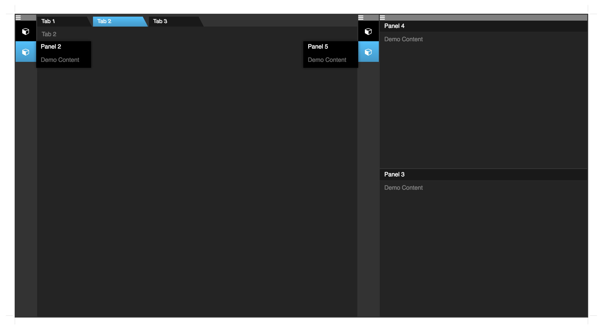
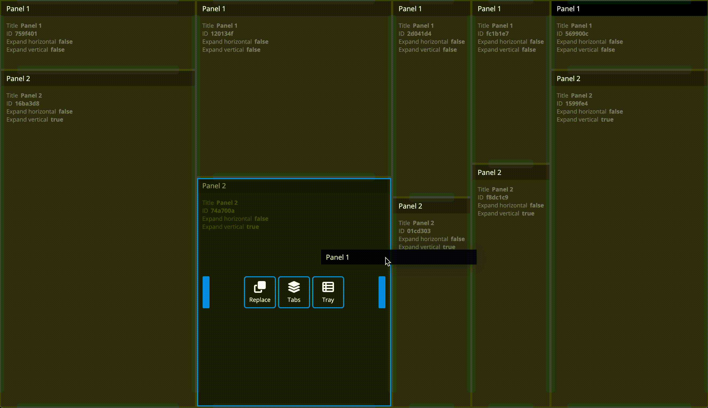

# STORM React Workspaces

---

__NOTE: V2 is still WIP but nearly ready__

TODO still:
* get serialization up to date
* emotion theme support for all the packages
* root workspace widget padding fix

---

__V1 DEMO__: http://projectstorm.cloud/react-workspaces/

The ultimate workspace management system to help you build super-modern desktop-grade
applications that have window management similar to Adobe / Jetbrains and Netbeans

## Usage

Take a look at the demos URL as well as the demos folder (docs will follow soon)
